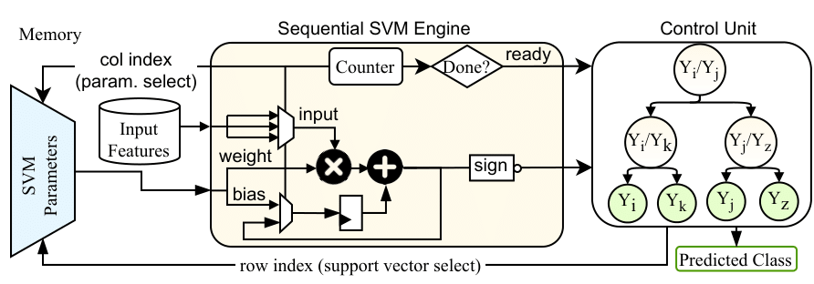

# Highly-Accurate Sequential Support Vector Machines Targeting Printed Electronics

This repository contains the hardware designs and Verilog implementations of sequential Support Vector Machine (SVM) classifiers optimized for Printed Electronics (PE). These classifiers achieve significantly lower area and power consumption compared to state-of-the-art printed ML models while maintaining high classification accuracy.

## 📜 Paper
Our work has been accepted at **ISCAS 2025**:  
**[Compact Yet Highly Accurate Printed Classifiers Using Sequential Support Vector Machine Circuits](link_to_paper)**  

## 🔥 Key Features
- **Sequential SVMs for Printed Electronics**: First-ever implementation of sequential SVM classifiers for PE.
- **Ultra-Low Area & Power**: Achieves **6× lower area** and **4.6% higher accuracy** compared to prior printed ML classifiers.
- **Automated Verilog Code Generation**: Hardware descriptions are auto-generated from trained SVM models.
- **Bespoke Control & Storage Units**: Custom memory and control circuits for efficiency.

## 🖼️ Architecture Overview

<!-- ## Coming Soon

 -->