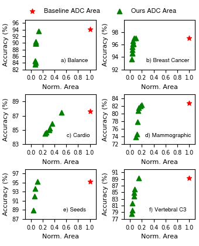

# Reducing ADC Front-end Costs During Training of On-sensor Printed Multilayer Perceptrons

[](https://doi.org/10.1109/LES.2024.3447412)
[](https://github.com/your-repo)

## Overview
This repository contains the code and resources for the paper:

**"Reducing ADC Front-end Costs During Training of On-sensor Printed Multilayer Perceptrons"**  
*Florentia Afentaki, Paula Carolina Lozano Duarte, Georgios Zervakis, Mehdi B. Tahoori*  
Accepted in IEEE Embedded Systems Letters 2024.

## Abstract
Printed electronics provide a cost-effective, customizable solution for on-sensor computing. However, printed classification systems suffer from high ADC costs, as ADCs dominate both area and power. This work proposes a novel approach that optimizes ADC design by minimizing required quantization levels per input, significantly reducing ADC complexity while maintaining high classification accuracy. Our approach achieves **11.2× lower ADC area** with **less than 5% accuracy drop** across varying MLPs.

## Key Contributions
- **ADC-aware training methodology** that integrates ADC pruning into MLP training.
- **Bespoke ADC design** using a genetic algorithm to explore optimal quantization levels.
- **Significant hardware savings**: 11.2× area and 13.2× power reduction with minor accuracy loss.
- **Hardware-aware evaluation** across multiple datasets with synthesized circuits.

## Repository Structure
```
├── README.md      # This file
├── paper.pdf      # Accepted paper in IEEE Embedded Systems Letters
├── src/           # Code for ADC pruning and MLP training
│   ├── adc.py                # Python script for ADC pruning
│   ├── main.py     # main python code
│   ├── genetic_tuning.py   # Genetic algorithm for ADC optimization
├── models/        # Trained models (if applicable)
├── data/          # Example datasets (if publicly available)
├── results/       # Experimental results (plots, logs, etc.)
├── figures/       # Diagrams and images from the paper
├── requirements.txt  # Dependencies for running the code
├── LICENSE        # Open-source license (MIT, Apache, etc.)
```

## Getting Started
### Installation
1. Clone the repository:
   ```bash
   git clone git@github.com:floAfentaki/Approximation-Techniques-Targeting-Printed-MLPs.git
   cd Approximation-Techniques-Targeting-Printed-MLPs/Reducing-ADC-Front-end-Costs-During-Training-of-On-sensor-Printed-Multilayer-Perceptrons
   ```
2. Create the environment from the src/env.yml file:
   ```bash
   cd src
   conda env create -f env.yml
   ```

3. Activate the new environment: 
    ```bash
    conda activate Qkeras
    ```


### Running the Code
#### MLP Training with ADC Optimization:
```bash
python src/main.py Balance
```

## Results
Our approach successfully reduces ADC complexity with minimal accuracy degradation:
- **Average 11.2× ADC area reduction**
- **Average 13.2× ADC power reduction**
- **Accuracy loss < 5%** across multiple datasets



## Citation
If you use this work, please cite:
```bibtex
@article{afentaki2024adc,
  author    = {Florentia Afentaki and Paula Carolina Lozano Duarte and Georgios Zervakis and Mehdi B. Tahoori},
  title     = {Reducing ADC Front-end Costs During Training of On-sensor Printed Multilayer Perceptrons},
  journal   = {IEEE Embedded Systems Letters},
  year      = {2024},
  doi       = {10.1109/LES.2024.3447412}
}
```
## Paper
If you want to learn more - read our [paper](paper.pdf)!

## License
This project is licensed under the MIT License - see the [LICENSE](LICENSE) file for details.

## Contact
For any questions or collaborations, please contact:  
Florentia Afentaki - [afentaki@ceid.upatras.gr](mailto:afentaki@ceid.upatras.gr)
